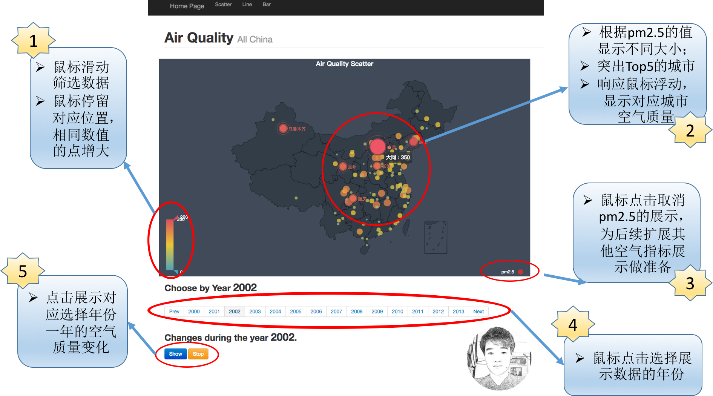
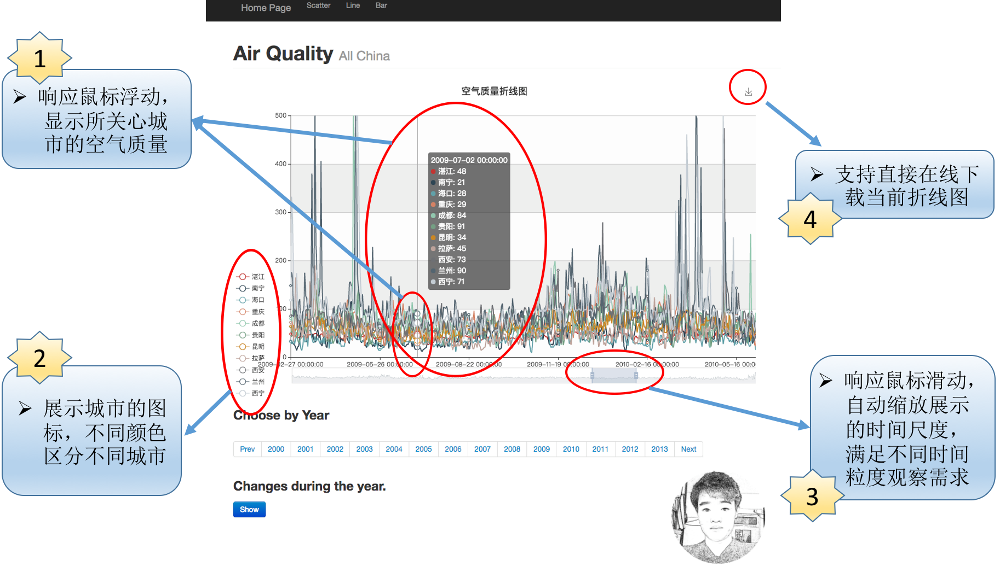
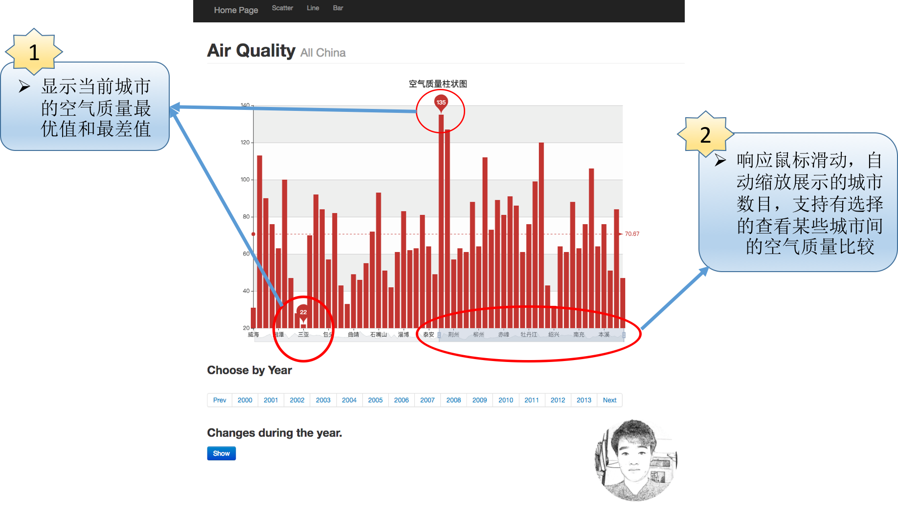

#### 空气质量可视化

##### 一、可视化设计

​	1. 数据源：[中国大陆重点城市空气质量（AQI）历史数据库](https://www.gracecode.com/aqi.html)

​	该据库基于 [中华人民共和国环境保护部信息中心](http://datacenter.mep.gov.cn/) 等公共数据来源抓取并汇总而成，提供给网友作为当地空气质量的历史数据参考。

​	**目前数据库包含 3231 个地区的总计 444391 条数据，时间跨度为 2000-06-05 至 2015-02-25。**

​	本次可视化作业设计展示全国范围的空气质量变化，需要有一定数量的历史数据，故自行从上述数据源爬取2000年6月至2013年12月全国各地空气质量（PM2.5值）的数据。

​	对应抓取下来的数据，处理为如下格式（部分数据示例）：

```javascript
{
  "湛江": [
    {
      "time": "2000-06-05 00:00:00",
      "value": 57
    },
    {
      "time": "2000-06-06 00:00:00",
      "value": 62
    },
    {
      "time": "2000-06-07 00:00:00",
      "value": 48
    },
	...
	...
	...
}
```

每个城市对应时间范围（2000.6.5~2013.12.31）的空气质量pm2.5的值。

​	本次作业主要的想法是挖掘空气质量在时间序列上是否有相关联系，并试图通过对时间序列建模来初步预测未来空气质量。所以主要设计了如下三个可视化页面。

##### 二、具体设计实现

​	前期探索数据，并试图为空气质量建立时序模型。具体采用了Facebook开源的时序预测模型Prophet，经实验发现预测效果不显著。后续放弃该方向继续探索，转而在空间范围内寻找数据见的联系，故设计如下第一个可视化页面。

</img>

​	如上图所示，②说明了该散点图的基本功能，即：

> 1. 用大小和颜色表达空气污染程度（pm2.5值），点越大则空气污染越严重，颜色越深空气污染越严重；
> 2. 突出显示Top5的城市，圆点呈放射状波动；
> 3. 响应鼠标浮动，显示对应城市的pm2.5值；

​	图中①为基本的交互设计，实现：

> 1. 鼠标拖动筛选展示空气质量的上下界；
> 2. 响应鼠标浮动，突出显示处于该值的城市(增大圆点面积，加深颜色)；

​	图中③点击切换不同空气指标展示，因为没有收集其他空气指标数据，故目前只支持点击，隐藏pm2.5的数据。

​	图中④响应鼠标点击，选择在地图中展示不同年份的空气质量数据。位于其上面的标题显示当前所选年份，如图为2012年全国的空气质量数据。

​	图中⑤响应鼠标点击，动态展示选中年份，一年对应的全国天气变化视图。可以在一定程度上观测到该年中全国天气动态变化的情况，是本次作业的一个较为重要的创新。

----


​	设计的第二个可视化页面为折线图，以比较不同城市空气质量变化间的趋势。如下图所示。

</img>

​	图中①表述了该折线图的基本功能，即响应鼠标浮动，给出当前时间所关心的城市空气质量数据。结合②以不同颜色区分不同的城市。

​	图中③响应鼠标滑动，可以缩放时间粒度，以满足不同粒度观测需求。

​	图中④提供了一个方便的保存当前折线图的功能，点击即可下载当前所示折线图，提供用户更多后续功能需求。

---


​	最后一个设计页面如下图所示。

</img>

​	图中①显示了当前城市的空气质量的最优和最差的值，方便用户直接获取数据。同时该柱状图响应鼠标浮动，显示对应城市的空气质量指标。

​	图中②的交互可以选择不同的城市数目，实际上是对第二个设计的一个补充，在城市粒度上的筛选。提供用户比较不同城市空气质量的功能。


---

##### 三、Demo

</img>

​	
